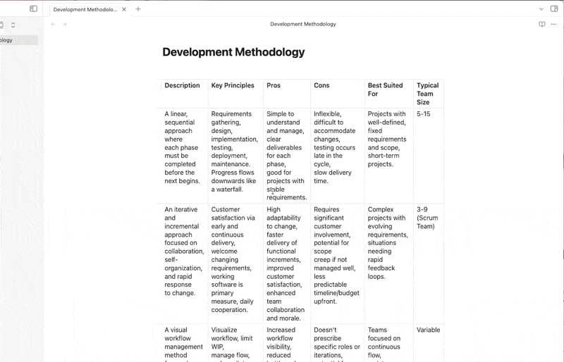
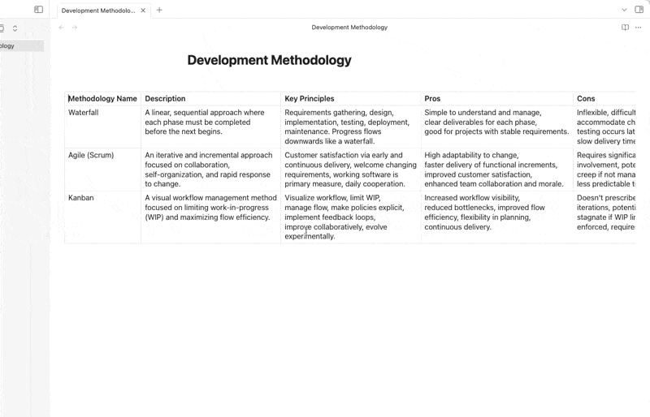

# Obsidian Fullwidth Table Plugin

Displays Markdown tables at the full content width in Obsidian's note view, preventing text wrapping and adding horizontal scroll for better readability, especially for tables with many columns.

## Before Installation

## After Installation

